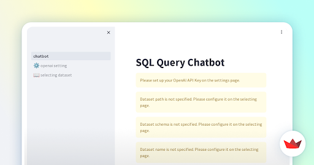
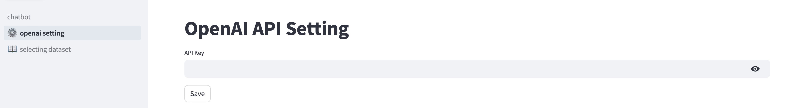
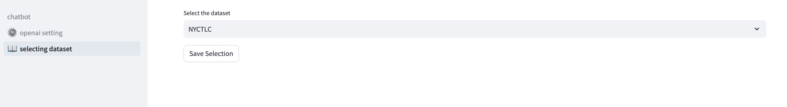
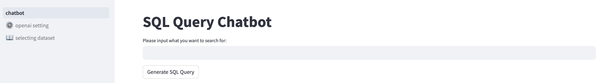

# chatdf

A Package to Chat with Polars/DuckDB Dataframes

## Introduction

`chatdf` is a Python package designed to provide an intuitive, chat-based interface for interacting with datasets using the Polars and DuckDB libraries. The goal is to simplify data operations and queries by allowing users to input natural language commands that the system translates into SQL queries or DataFrame operations. This tool aims to make data analytics more accessible and user-friendly, especially for those who may not be comfortable with traditional programming approaches.

## Installation

Install `chatdf` using pip:

```bash
$ pip install chatdf
```

## Usage

Here are some basic examples of how to use chatdf to perform data operations:

### Example 1: Load Data
```python
from chatdf import DataLoader

# Load data from a path
df = DataLoader.load("path/to/your/data.parquet")
```

### Example 2: Query Data using Natural Language
```python
from chatdf import ChatQuery

# Initialize the chat query interface
chat = ChatQuery(df)

# Perform a query using natural language
result = chat.query("show me sales greater than $500")
```

## Chatbot
Visit our web application to interact with chatdf through a user-friendly chat interface: [Web version](https://chatbotpy-5rvjgceuhzisrfymppycmw.streamlit.app)



### Introduction

This web application, developed using the Streamlit framework, is designed to enhance user convenience in utilizing our software package. Should you encounter any difficulties or have questions regarding its usage, please consult the [documentation](web_info/documentation.md) or reach out to our development team for support.

### Getting Started with Your API Key

- Navigate to the 'openai settings' in our application.
- Enter your API Key. We use the `GPT-4-0125-preview` model, so please ensure your API Key is compatible with this version. For more details or if you encounter any issues, visit the OpenAI [official website](https://platform.openai.com).
 


### Selecting a Dataset

- Go to 'selecting dataset' and choose the dataset you wish to analyze. Currently, we only support the NYCTLC dataset.



### Ask Questions

- Once set up, feel free to ask any questions you have about the data!



We hope you find this tool useful, and we’re here to help with any questions you might have.

### Limitations

Currently, the application supports predefined datasets. We are actively working on expanding its capabilities to include user-uploaded and customizable datasets, which will significantly enhance the application’s utility and flexibility.

## Architecture

Below is a diagram illustrating the architecture of chatdf. This helps in understanding how different components of the package interact with each other:


## Contributing

Interested in contributing? Check out the contributing guidelines. Please note that this project is released with a Code of Conduct. By contributing to this project, you agree to abide by its terms.

## License

`chatdf` was created by Dheeraj Oruganty, Pranav Patil, Yifan. It is licensed under the terms of the MIT license.

## Credits

`chatdf` was created with [`cookiecutter`](https://cookiecutter.readthedocs.io/en/latest/) and the `py-pkgs-cookiecutter` [template](https://github.com/py-pkgs/py-pkgs-cookiecutter).
